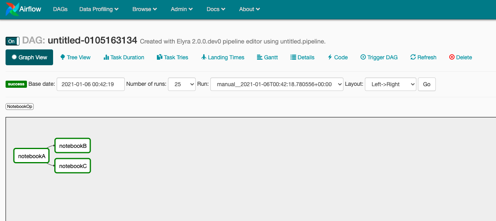

<!--

Copyright 2018-2020 IBM Corporation

Licensed under the Apache License, Version 2.0 (the "License");
you may not use this file except in compliance with the License.
You may obtain a copy of the License at

http://www.apache.org/licenses/LICENSE-2.0

Unless required by applicable law or agreed to in writing, software
distributed under the License is distributed on an "AS IS" BASIS,
WITHOUT WARRANTIES OR CONDITIONS OF ANY KIND, either express or implied.
See the License for the specific language governing permissions and
limitations under the License.

-->

Airflow-Notebook is a Notebook operator to enable running notebooks as part of an Airflow DAG.
This package is installed on the host(s) where Apache Airflow webserver and scheduler
applications reside.


## Building airflow-notebook

```bash
make clean install
```

## Usage

Example below on how to use the airflow operator. This particular DAG was generated with a jinja template in
Elyra's pipeline editor.

```python
from airflow import DAG
from airflow_notebook.pipeline import NotebookOp
from airflow.utils.dates import days_ago

# Setup default args with older date to automatically trigger when uploaded
args = {
    'project_id': 'untitled-0105163134',
}

dag = DAG(
    'untitled-0105163134',
    default_args=args,
    schedule_interval=None,
    start_date=days_ago(1),
    description='Created with Elyra 2.0.0.dev0 pipeline editor using untitled.pipeline.',
    is_paused_upon_creation=False,
)


notebook_op_6055fdfb_908c_43c1_a536_637205009c79 = NotebookOp(name='notebookA',
                                                              namespace='default',
                                                              task_id='notebookA',
                                                              notebook='notebookA.ipynb',
                                                              cos_endpoint='http://endpoint.com:31671',
                                                              cos_bucket='test',
                                                              cos_directory='untitled-0105163134',
                                                              cos_dependencies_archive='notebookA-6055fdfb-908c-43c1-a536-637205009c79.tar.gz',
                                                              pipeline_outputs=[
                                                                  'subdir/A.txt'],
                                                              pipeline_inputs=[],
                                                              image='tensorflow/tensorflow:2.3.0',
                                                              in_cluster=True,
                                                              env_vars={'AWS_ACCESS_KEY_ID': 'a_key',
                                                                        'AWS_SECRET_ACCESS_KEY': 'a_secret_key', 'ELYRA_ENABLE_PIPELINE_INFO': 'True'},
                                                              config_file="None",
                                                              dag=dag,
                                                              )


notebook_op_074355ce_2119_4190_8cde_892a4bc57bab = NotebookOp(name='notebookB',
                                                              namespace='default',
                                                              task_id='notebookB',
                                                              notebook='notebookB.ipynb',
                                                              cos_endpoint='http://endpoint.com:31671',
                                                              cos_bucket='test',
                                                              cos_directory='untitled-0105163134',
                                                              cos_dependencies_archive='notebookB-074355ce-2119-4190-8cde-892a4bc57bab.tar.gz',
                                                              pipeline_outputs=[
                                                                  'B.txt'],
                                                              pipeline_inputs=[
                                                                  'subdir/A.txt'],
                                                              image='elyra/tensorflow:1.15.2-py3',
                                                              in_cluster=True,
                                                              env_vars={'AWS_ACCESS_KEY_ID': 'a_key',
                                                                        'AWS_SECRET_ACCESS_KEY': 'a_secret_key', 'ELYRA_ENABLE_PIPELINE_INFO': 'True'},
                                                              config_file="None",
                                                              dag=dag,
                                                              )

notebook_op_074355ce_2119_4190_8cde_892a4bc57bab << notebook_op_6055fdfb_908c_43c1_a536_637205009c79


notebook_op_68120415_86c9_4dd9_8bd6_b2f33443fcc7 = NotebookOp(name='notebookC',
                                                              namespace='default',
                                                              task_id='notebookC',
                                                              notebook='notebookC.ipynb',
                                                              cos_endpoint='http://endpoint.com:31671',
                                                              cos_bucket='test',
                                                              cos_directory='untitled-0105163134',
                                                              cos_dependencies_archive='notebookC-68120415-86c9-4dd9-8bd6-b2f33443fcc7.tar.gz',
                                                              pipeline_outputs=[
                                                                  'C.txt', 'C2.txt'],
                                                              pipeline_inputs=[
                                                                  'subdir/A.txt'],
                                                              image='elyra/tensorflow:1.15.2-py3',
                                                              in_cluster=True,
                                                              env_vars={'AWS_ACCESS_KEY_ID': 'a_key',
                                                                        'AWS_SECRET_ACCESS_KEY': 'a_secret_key', 'ELYRA_ENABLE_PIPELINE_INFO': 'True'},
                                                              config_file="None",
                                                              dag=dag,
                                                              )

notebook_op_68120415_86c9_4dd9_8bd6_b2f33443fcc7 << notebook_op_6055fdfb_908c_43c1_a536_637205009c79
```

## Generated Airflow DAG


