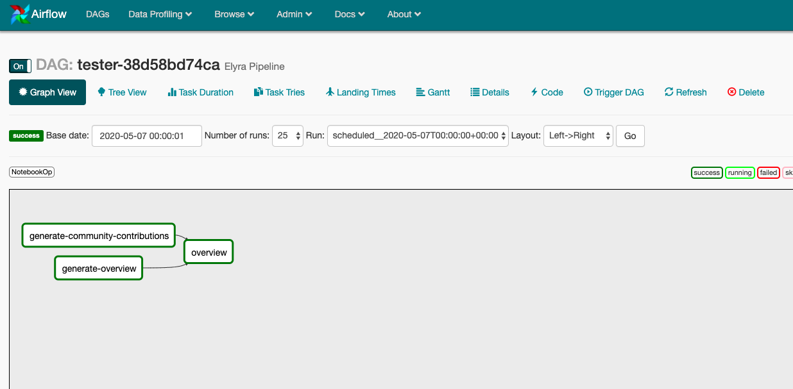

<!--

Copyright 2018-2020 IBM Corporation

Licensed under the Apache License, Version 2.0 (the "License");
you may not use this file except in compliance with the License.
You may obtain a copy of the License at

http://www.apache.org/licenses/LICENSE-2.0

Unless required by applicable law or agreed to in writing, software
distributed under the License is distributed on an "AS IS" BASIS,
WITHOUT WARRANTIES OR CONDITIONS OF ANY KIND, either express or implied.
See the License for the specific language governing permissions and
limitations under the License.

-->

Airflow-Notebook is an Notebook op to enable running notebooks as part of a Airflow DAG.
This package is installed on the host(s) where Apache Airflow webserver and scheduler 
applications reside.


## Building airflow-notebook

```bash
make clean install
```

## Usage

Example below on how to use the operator for testing purposes.

```python
from airflow import DAG
from datetime import datetime, timedelta
from notebook_op import NotebookOp

def run_notebook_op(op_name, cos_pull_archive, pipeline_outputs, pipeline_inputs):
    op = NotebookOp(name=op_name,
                    namespace='default',
                    task_id=op_name,
                    notebook=op_name,
                    cos_endpoint='http://object.storage:30000',
                    cos_bucket='test-bucket',
                    cos_directory='test-directory',
                    cos_pull_archive=cos_pull_archive,
                    pipeline_outputs=pipeline_outputs,
                    pipeline_inputs=pipeline_inputs,
                    image='elyra/tensorflow:1.15.2-py3',
                    in_cluster=True,
                    env_vars={'AWS_ACCESS_KEY_ID': 'minio', 'AWS_SECRET_ACCESS_KEY': 'minio123',
                              'GITHUB_TOKEN': 'XXXXXXXXXXXXX'},
                    dag=dag,
    )
    return op

default_args = {
    'start_date': datetime(2020, 1, 1),
    'project_id' : '{{ pipeline_name }}',
    'retries': 1,
    'retry_delay': timedelta(minutes=3),
}

dag = DAG(
    'test_dag',
    default_args=default_args,
    description='A Sample Test DAG',
)

notebook_op_1 = run_notebook_op('generate-community-contributions',
                                'generate-community-contributions-37215ef9-70b2-450d-b1e0-655df0b96d6e.tar.gz',
                                'community_contributions.csv',
                                'None'
                                )

notebook_op_2 = run_notebook_op('generate-overview',
                                'generate-overview-5244c826-ca17-493c-aeb8-e7a224f44527.tar.gz',
                                'community_overview.csv',
                                'None',
                                )


notebook_op_3 = run_notebook_op('overview',
                                'overview-3dbdd4e8-dc24-489e-bb89-f4e6b9b5e52a.tar.gz',
                                'None',
                                'community_contributions.csv,community_overview.csv',
                                )

notebook_op_1 << notebook_op_3

notebook_op_2 << notebook_op_3


```

## Generated Airflow DAG


